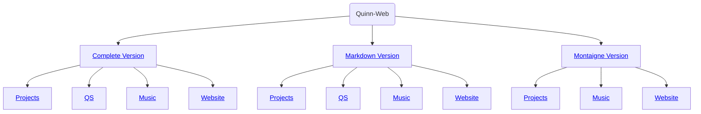

<link rel="stylesheet" type="text/css" href="/css/page.css" />
<link rel="stylesheet" type="text/css" href="/css/text.css" />

# Home
## Hi! I'm Quinn Qiu.
###  Profile
-  16, Boy
-  Student
-  Programmer
-  Apple-lover
-  Sportsman
-  Photographer
-  Minecraftor

###  Time Line
- Due to some problem with this area, it has been quarantined. 

